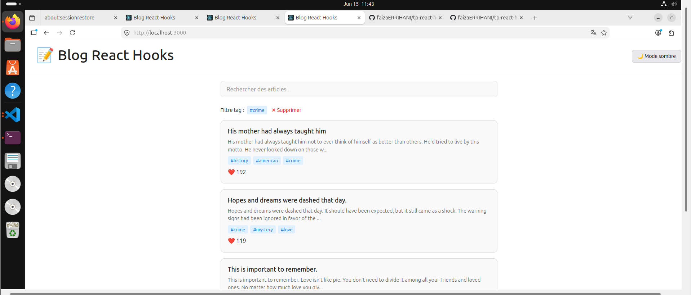
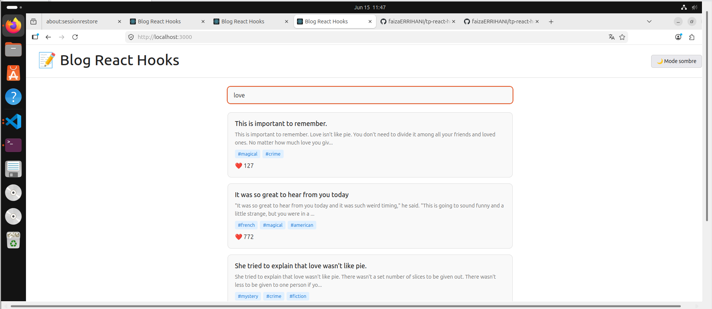
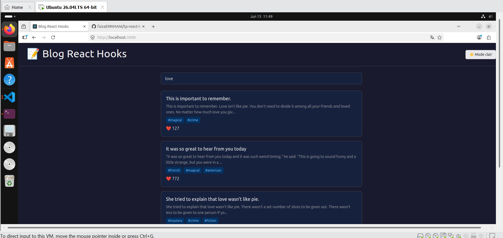
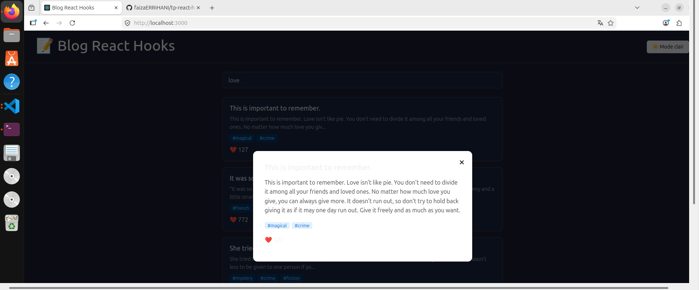
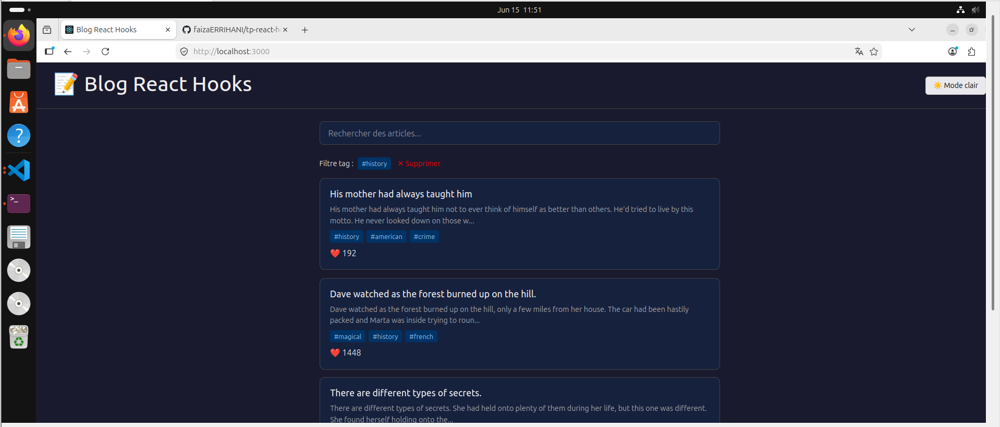

# TP React Hooks - Application de Blog

Ce TP met en pratique les Hooks React (useState, useEffect, useCallback, useMemo) ainsi que la création de Hooks personnalisés à travers une application de blog.

## Installation

```bash
git clone https://github.com/pr-daaif/tp-react-hooks-blog.git
cd tp-react-hooks-blog
npm install
npm start
```

---

## Exercice 1 : État et Effets

### Solution
- `usePosts` : utilise `useEffect` pour fetcher les posts depuis `dummyjson.com`. Gère les états `loading`, `error`, et `posts`.
- `PostList` : mappe sur le tableau de posts et affiche titre, extrait du body (150 chars), tags et réactions.
- `PostSearch` : input contrôlé avec `onChange` qui remonte la valeur via `onSearchChange`. Utilise l'endpoint `/posts/search?q=` pour filtrer.

### Captures d'écran



---

## Exercice 2 : Hooks Personnalisés

### Solution
- `useDebounce` : utilise `useEffect` + `setTimeout` pour retarder la mise à jour d'une valeur de 500ms. Annule le timer avec `clearTimeout` si la valeur change avant la fin du délai.
- `useLocalStorage` : initialise l'état depuis `localStorage` via une fonction lazy dans `useState`. La fonction `setValue` met à jour à la fois l'état React et `localStorage`.
- `useDebounce` utilisé dans `App.js` pour la recherche. `useLocalStorage` utilisé dans `ThemeContext` pour persister le thème.

### Captures d'écran


---

## Exercice 3 : Optimisation et Context

### Solution
- `ThemeContext` : créé avec `createContext()`. Le `ThemeProvider` utilise `useLocalStorage` pour persister le thème et expose `theme` + `toggleTheme` via le context.
- `ThemeToggle` : consomme le context via `useTheme()` et affiche mode sombre ou clair selon le thème actuel.
- `useCallback` utilisé sur `toggleTheme` et `handleTagClick` pour stabiliser les références.
- `useMemo` utilisé sur la valeur du context pour éviter des re-renders inutiles.

### Captures d'écran



---

## Exercice 4 : Fonctionnalités Avancées

### Solution
- `useIntersectionObserver` : utilise l'API native `IntersectionObserver` pour détecter quand un élément sentinel entre dans le viewport. Quand visible, charge plus de posts automatiquement.
- `PostDetails` : modal qui fetch les détails complets du post via `/posts/{id}` au clic. Fermeture en cliquant sur l'overlay ou le bouton X.
- Filtrage par tags : clic sur un tag met à jour `activeTag`. L'URL devient `/posts/tag/{tag}`.

### Captures d'écran



---

## Lien GitHub

https://github.com/faizaERRIHANI/tp-react-hooks-blog
